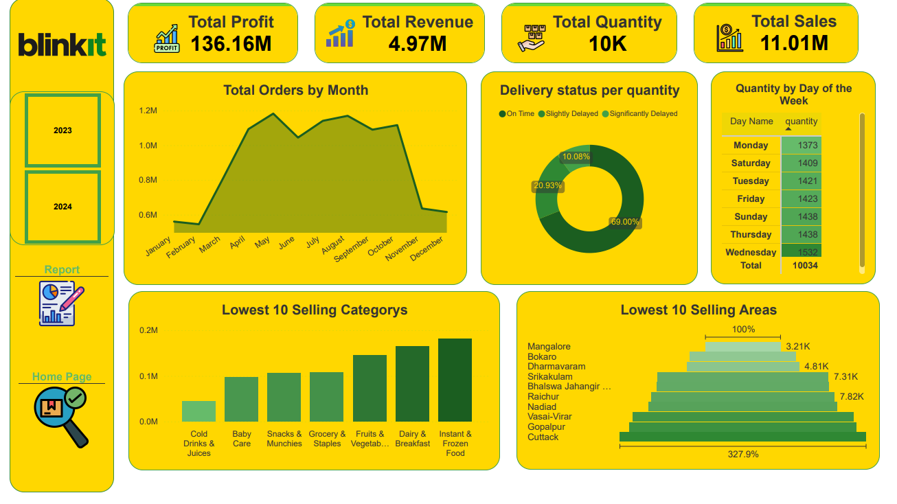

# Blinkit Sales Analysis

## 📌 Project Overview
This project analyzes Blinkit sales data to uncover insights about sales performance, customer behavior, product categories, and delivery efficiency.

## 🛠️ Tools & Technologies
- Python (Pandas, Matplotlib, Seaborn)
- Power BI (Dashboard & DAX Measures)
- MS Word (Business & Technical Reports)

## 📂 Project Structure
- `notebooks/` → Data Cleaning, Preprocessing, EDA
- `dashboard/` → Power BI file (`.pbix`)
- `reports/` → Business & Technical Reports
- `images/` → Dashboard screenshots

## 📊 Key Insights
- May is the highest-selling month, January & February the lowest.
- Monday shows lowest sales volume; Wednesday the highest.
- Spinach is the lowest-selling product; Rice leads among the bottom 10.
- 69% orders on time, 31% delayed (20.93% slightly, 10.08% significantly).

## 📈 Dashboard Preview

## 👤 Author
**Amr Abdelhamid Elbrolosy**
